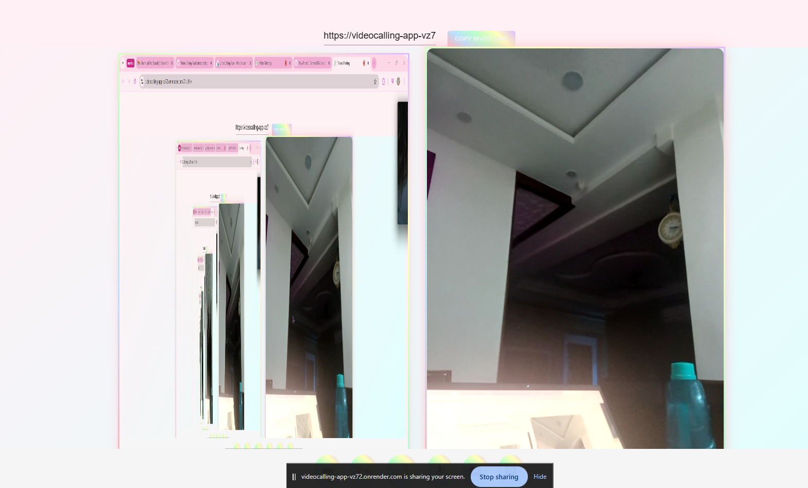

# 🌐 Video Calling Web Application

A modern, real-time **video calling web application** built with **React**, **Node.js**, **Socket.IO**, and **WebRTC**.  
This app allows users to create and join video calls, chat, toggle audio/video, and share screens—all in a responsive, user-friendly interface.  

---

## 🎯 Features

### **Core Features**
- Create a new video call meeting with a **unique link/ID**.
- Join existing meetings via link/ID.
- Real-time chat with other participants.
- Toggle **microphone** and **camera** on/off.
- **Screen sharing** support.

### **Optional / Advanced Features**
- Dark/Light mode toggle for accessibility.
- Admin controls:
  - Mute/unmute participants.
  - Allow/deny entry to the meeting.
  - Grant screen sharing permissions.
- Schedule future meetings (bonus).

---

## 💻 Tech Stack

| Layer          | Technology                       |
|----------------|---------------------------------|
| Frontend       | React, Material-UI, Ant Design  |
| Backend        | Node.js, Express, Socket.IO      |
| Database       | MongoDB (optional for scheduling) |
| Real-Time Comm | WebRTC                           |
| Styling        | CSS3, Bootstrap, Reactstrap      |
| Deploying        | Render                         |

---

## 📸 Output / Screenshots

Here’s how the application looks and works in action:

### **1. Set Username & Join Meeting**
 
*Enter your username and connect to start a video call.*

---

### **2. Video Call Interface**
  
*Multiple participants in a video call with audio/video toggle and screen sharing.*

---

### **3. Chat Functionality**

*Real-time messaging with all participants.*

---

### **4. Screen Sharing**

*Participants can share their screen in real-time.*

---

### **5. Dark Mode**
 
*Toggle dark/light mode for better accessibility and user experience.*


## 🚀 Getting Started (Run Locally)

### **Prerequisites**
- Node.js (v14+ recommended)
- npm or yarn
- Chrome browser (WebRTC features best supported)
- Optional: MongoDB if using scheduling or persistent data

---

### **Setup Backend**
```bash
cd backend
npm install
npm run dev
